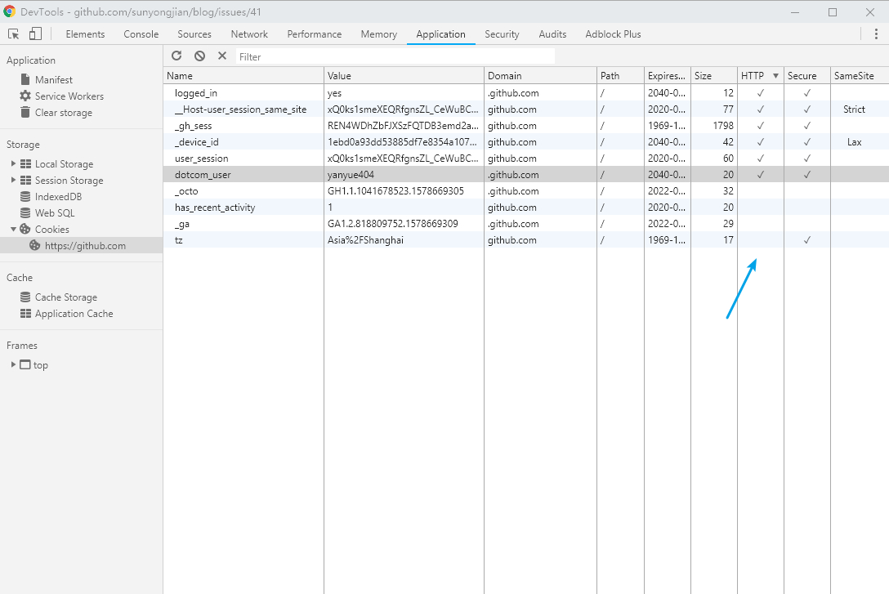
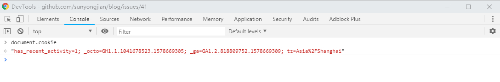

不安全还提什么优化？

## XSS

> **跨网站指令码**（英语：Cross-site scripting，通常简称为：XSS，为了与层叠样式表CSS区别）

### **如何攻击**

XSS 攻击是指，通过执行恶意脚本，以实现窃取用户登陆态、劫持会话等目的的攻击方式。恶意脚本的输入源有，Cookies、Post 表单、Get 请求、HTTP 头内容等。通常，我们将一段 XSS 攻击的代码片段称之为 XSS 向量。

### **如何防御**

1. 关键 Cookie 设置 HttpOnly：只能服务器端修改
2. 输入,输出检查：不要相信用户的任何输入
3. CSP 网站内容安全白名单过滤

**`cookie`不可被获取**：

[](https://camo.githubusercontent.com/fc5a5488e0283bec3789109f9e872fd32f530f06/687474703a2f2f7777312e73696e61696d672e636e2f6c617267652f64663535316561356c793167617279757267776b6e6a32307538306b37337a742e6a7067)

[](https://camo.githubusercontent.com/6a7ebfbe75c87305ee820d8ef9fe99fee5532726/687474703a2f2f7777312e73696e61696d672e636e2f6c617267652f64663535316561356c7931676172797672716734386a323075383035306a726c2e6a7067)

**输入输出的内容，对于引号，尖括号，斜杠进行转义：**

```
function escape(str) {
  str = str.replace(/&/g, '&amp;');
  str = str.replace(/</g, '&lt;');
  str = str.replace(/>/g, '&gt;');
  str = str.replace(/"/g, '&quto;');
  str = str.replace(/'/g, '&#39;');
  str = str.replace(/`/g, '&#96;');
  str = str.replace(/\//g, '&#x2F;');
  return str;
}
```

通过转义可以将攻击代码 `alert(1)` 变成

```
// escape('<script>alert(1)</script>');
&lt;script&gt;alert(1)&lt;&#x2F;script&gt;
```

对于显示富文本来说，不能通过上面的办法来转义所有字符，因为这样会把需要的格式也过滤掉。这种情况通常采用白名单过滤的办法，当然也可以通过黑名单过滤，但是考虑到需要过滤的标签和标签属性实在太多，更加推荐使用白名单的方式(如 [sanitize-html](https://github.com/apostrophecms/sanitize-html/))。

```
var xss = require('xss');
var html = xss('<h1 id="title">XSS Demo</h1><script>alert("xss");</script>');
// -> <h1>XSS Demo</h1>&lt;script&gt;alert("xss");&lt;/script&gt;
console.log(html);
```

以上示例使用了 [js-xss](https://github.com/leizongmin/js-xss) 来实现。可以看到在输出中保留了 `h1` 标签且过滤了 `script` 标签

**CSP 通过白名单控制，仅允许加载指定的资源:**

通常可以通过 HTTP Header 中的 `Content-Security-Policy` 来开启 CSP

- 只允许加载本站资源

```
Content-Security-Policy: default-src ‘self’
```

- 只允许加载 HTTPS 协议图片

```
Content-Security-Policy: img-src https://*
```

- 允许加载任何来源框架

```
Content-Security-Policy: child-src 'none'
```

更多属性可以查看 [这里](https://content-security-policy.com/)

## CSRF

> **跨站请求伪造**（英语：Cross-site request forgery）

1. get 不修改数据
2. 不被第三方网站访问到用户的 cookie
3. Referer（该 HTTP 请求的来源地址）检查，阻止第三方网站请求接口
4. 请求时附带验证信息，比如验证码或者 token

