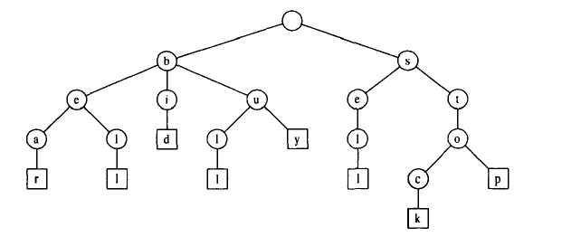

## 术语

+ 回文

   “*回文串*”是一个正读和反读都一样的*字符串* 

+ 子串（连续）

   串中任意个连续的字符组成的子序列称为该串的*子串* 

+ 子序列（不连续）

   *子序列*是指一个子串中非连续的字串 

+ 前缀树（trie、字典树）

  + 前缀（prefix）就是从字符串的开头到某个位置`i`截出的子串 

  + 定义

    + 令S是取自字母表∑的s个集合，满足S中不存在一个串是另一个串的前缀。S的一个标准Trie（standard trie）是一颗有序树T，满足如下性质：

      - 除了根之外，T中的每个结点标记有∑的一个字符。
      - T中一个内部结点的子结点的次序有字母表∑上的规范次序确定。
      - T有s个外部结点（叶结点），每个外部结点关联S中的一个串，满足从根到T中一个外部结点v的路径上标记连接产生S中关联的一个串。

      下图是串{bear,bell,bid,bull,buy,sell,stock,stop}的标准Trie

      

  + 特点

    + 根节点不包含字符，除根节点外每个节点只包含一个字符。
    + 从根节点到某个节点，路径上所有的字符连接起来，就是这个节点所对应的字符串。
    + 每个节点的子节点所包含的字符都不同。

+ 后缀树和后缀数组

  +  后缀（suffix）就是从字符串的某个位置`i`到字符串末尾截出的子串 
  + 后缀树与前缀树的概念一致
  + 后缀数组并不是很多后缀的集合，而是很多后缀按字典序排序后，每一个后缀所对应的**位置`i`的集合**。

+ 匹配

  一个字符串出现于另一个字符串中的 现象称为匹配。

+ 字典序

   原意是表示英文单词在字典中的先后顺序，在计算机领域中扩展成两个任意字符串的大小关系。也就是先按照每个字符串的第一个字符排序，若字符相同则按第二个字符排序，依次类推。

## 基本操作

+ 增
  + `+`
  + [`String.prototype.padStart()`](https://developer.mozilla.org/zh-CN/docs/Web/JavaScript/Reference/Global_Objects/String/padStart) 
  +  [`String.prototype.padEnd()`](https://developer.mozilla.org/zh-CN/docs/Web/JavaScript/Reference/Global_Objects/String/padEnd) 
  +  [`String.prototype.concat()`](https://developer.mozilla.org/zh-CN/docs/Web/JavaScript/Reference/Global_Objects/String/concat) 
+ 删
  +  [`String.prototype.slice()`](https://developer.mozilla.org/zh-CN/docs/Web/JavaScript/Reference/Global_Objects/String/slice) 
  +  [`String.prototype.substring()`](https://developer.mozilla.org/zh-CN/docs/Web/JavaScript/Reference/Global_Objects/String/slice) 
  +  [`String.prototype.trim()`](https://developer.mozilla.org/zh-CN/docs/Web/JavaScript/Reference/Global_Objects/String/trim) ——会改变原字符串
+ 改
  +  [`String.prototype.replace()`](https://developer.mozilla.org/zh-CN/docs/Web/JavaScript/Reference/Global_Objects/String/replace) 
+ 查
  +  [`String.prototype.charAt()`](https://developer.mozilla.org/zh-CN/docs/Web/JavaScript/Reference/Global_Objects/String/charAt) 
  +  [`String.prototype.charCodeAt()`](https://developer.mozilla.org/zh-CN/docs/Web/JavaScript/Reference/Global_Objects/String/charCodeAt) 
  +  [`String.prototype.endsWith()`](https://developer.mozilla.org/zh-CN/docs/Web/JavaScript/Reference/Global_Objects/String/endsWith) 
  + [`String.prototype.includes()`](https://developer.mozilla.org/zh-CN/docs/Web/JavaScript/Reference/Global_Objects/String/includes) 
  + [`String.prototype.indexOf()`](https://developer.mozilla.org/zh-CN/docs/Web/JavaScript/Reference/Global_Objects/String/indexOf) 
  +  [`String.prototype.match()`](https://developer.mozilla.org/zh-CN/docs/Web/JavaScript/Reference/Global_Objects/String/match) 
  +  [`String.prototype.lastIndexOf()`](https://developer.mozilla.org/zh-CN/docs/Web/JavaScript/Reference/Global_Objects/String/lastIndexOf) 
  +  [`String.prototype.search()`](https://developer.mozilla.org/zh-CN/docs/Web/JavaScript/Reference/Global_Objects/String/search) 
+ 字符串旋转
+ 