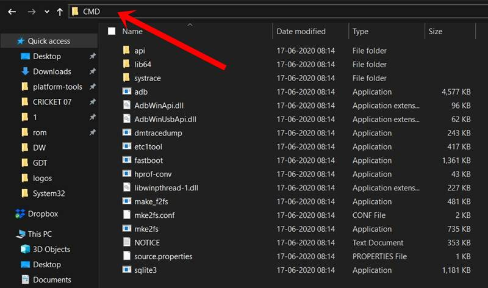
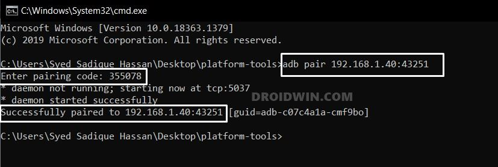
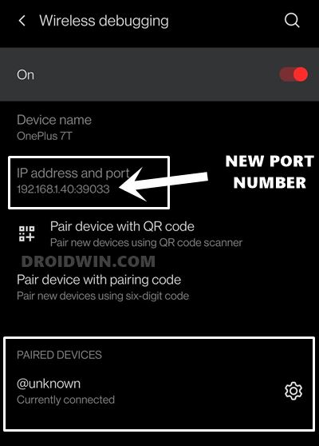
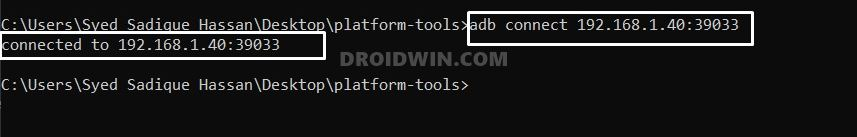

## 经历过的坑

1. chrome调试安卓机的时候打开的调试页面会显示“HTTP/1.1 404 Not Found ”错误
   解决办法：开启电脑vpn，全局模式即可解决。
2. npm 安装到"devDependencies"中时，-D的D必须大写！！
3. 被`keep-alive`包裹的多个页面，若仅仅路由的传参不同，那么这些页面复用的同一个组件实际上是重用了同一个内存地址。那么当可复用组件需要通过`prop`由这些页面传参时，需要`watch`这个组件传参的`prop`以保证所传参数的更新，或者使用`activated`。

## HTML

### 属性名

### title属性

HTML元素的title属性可以用作鼠标悬停时的提示语。

## JavaScript

### 解构赋值在函数的传值的应用

~~~js
//定义
function xixi({name,age}){
    console.log("我的名字是："+name+"年龄是："+age);   
}

//传参
xixi({
       age:25,
       name:"fx"
    })
~~~


### 使用for..in..的注意事项

`for...in` 的问题在于它会遍历到原型链上的属性，，使用时需要加上 `obj.hasOwnProperty(key)` 判断才安全。

在 ES2015+ 中，使用 `for (const key of Object.keys(obj))` 或者 `for (const [key, value] of Object.entries(obj))` 可以绕开这个问题。

> 顺便提一下 `Object.keys()`、`Object.getOwnPropertyNames()`、`Reflect.ownKeys()` 的区别：我们最常用的一般是 `Object.keys()` 方法，`Object.getOwnPropertyNames()` 会把 `enumerable: false` 的属性名也加进来，而 `Reflect.ownKeys()` 在此基础上还会加上 `Symbol` 类型的键。

~~~js
let aa=["a","c","d"];
Array.prototype.peek=function(){}
for(let i in aa){console.log(i)}
//0
//1
//2
//peek
~~~

### Promise.all(*list*)

它只是用于对*list*中的每一个元素的状态作检查。若某个元素为promise对象，作为该元素实参的函数早已在Promise.all(*list*)执行前执行了。


### 关键字const 的命名并不准确

`const` 关键词所定义的是一个 *immutable binding*（类似于 Java 中的 `final` 关键词），而非真正的常量（ *constant* ）。

也就是说：const仅会阻止其定义的标识符所存储的指针。

### prototype 的两个槽点

第一点是它的命名不合理。

> There are only two hard things in Computer Science: cache invalidation and naming things -- Phil Karlton

JavaScript 中的各种词不达意的命名已经让人无力吐槽了……

作为对象属性的 `prototype`，其实根本就不是我们讨论原型继承机制时说的「原型」概念。[`fallbackOfObjectsCreatedWithNew` would be a better name.](https://johnkpaul.github.io/presentations/empirejs/javascript-bad-parts/#/11)

 而对象真正意义上的原型，在 ES5 引入 `Object.getPrototypeOf()` 方法之前，我们并没有常规的方法可以获取。

不过很多浏览器都实现了非标准的 `__proto__`（IE 除外），在 ES2015 中，这一扩展属性也得以标准化了。


### 数组的 "holes"

产生 holes 的方法有两种：一是定义数组字面量时写两个连续的逗号：`var a = [1, , 2]`；二是使用 `Array` 对象的构造器，`new Array(3)`。

数组的各种方法对于 holes 的处理非常非常非常不一致，有的会跳过（`forEach`），有的不处理但是保留（`map`），有的会消除掉 holes（`filter`），还有的会当成 undefined 来处理（`join`）。这可以说是 JavaScript 中最大的坑之一，不看文档很难自己理清楚。

具体可以参考这两篇文章： - [Array iteration and holes in JavaScript](http://www.2ality.com/2013/07/array-iteration-holes.html) - [ECMAScript 6: holes in Arrays](http://www.2ality.com/2015/09/holes-arrays-es6.html)

### arguements的代替品

在 ES2015 中，`arguments` 对象不再被建议使用，我们可以用 [rest parameter](https://developer.mozilla.org/zh-CN/docs/Web/JavaScript/Reference/Functions/Rest_parameters) （`function f(...args) {}`）代替，这样拿到的对象就直接是数组了。

- 剩余参数只包含那些没有对应形参的实参，而 `arguments` 对象包含了传给函数的所有实参。
- `arguments`对象不是一个真正的数组，而剩余参数是真正的 `Array`实例，也就是说你能够在它上面直接使用所有的数组方法，比如 `sort`，`map`，`forEach`或`pop`。
- `arguments`对象还有一些附加的属性 （如`callee`属性）。


### 关于instanceof

~~~js
"" instanceof String  //false
~~~


### 关于for循环

`for`循环还有一个特别之处，就是设置循环变量的那部分是一个父作用域，而循环体内部是一个单独的子作用域。

```javascript
for (let i = 0; i < 3; i++) {
  let i = 'abc';
  console.log(i);
}
// abc
// abc
// abc
```

上面代码正确运行，输出了 3 次`abc`。这表明函数内部的变量`i`与循环变量`i`不在同一个作用域，有各自单独的作用域（同一个作用域不可使用 `let` 重复声明同一个变量）。

#### 扩展运算符

扩展运算符还可以将字符串转为真正的数组。

```javascript
[...'hello']
// [ "h", "e", "l", "l", "o" ]
```
下面的写法，有一个重要的好处，那就是能够正确识别四个字节的 Unicode 字符。
~~~js
'x\uD83D\uDE80y'.length // 4
[...'x\uD83D\uDE80y'].length // 3
~~~

将类似数组的对象转化为数组

~~~js
// ES5的写法
var arr1 = [].slice.call(arrayLike); // ['a', 'b', 'c']

// ES6的写法
let arr2 = Array.from(arrayLike); // ['a', 'b', 'c']
~~~

#### 数组的填充

```javascript
Array.from({ length: 2 }, () => 'jack')//['jack','jack']

new Array(3).fill(7)// [7, 7, 7]
```

## Vue

### 行为

vue的核心工作就是代替用户操作DOM，编写的代码只需要关注逻辑层面。这个操作可以表述为“绑定”，所谓“绑定”即“保持一致”：保持DOM的——文本、结构、attribute、事件及其处理函数与Vue代码的 变量值 或 逻辑 一致。

对于继承的组件，祖先的生命周期函数的行为不会被覆盖。

## CSS

### 文字的强制换行

~~~css
 white-space: break-spaces;
~~~

### flex

+ 父元素内设置
  
  ```css
  display:flex;
  flex-flow:flex-direction flex-wrap;
/* 
  flex-direction:(row、row-reverse、column、column-reverse)
  flex-wrap:(nowrap、wrap、wrap-reverse) 
  */
  
  /*主轴方向上如何排列以处理空白部分*/
  justify-content:(flex-start,flex-end,center,space-between,space-around);
  /*交叉轴方向上如何排列以处理空白部分*/
  align-items:（strech,flex-start,flex-end,center,baseline）;
  /*定义两个轴线方向的综合对齐方式 见https://developer.mozilla.org/zh-CN/docs/Web/CSS/align-content*/
  align-content
  ```


+ 子元素内设置

  ```css
  flex:flex-grow flex-shrink flex-basis;
  /*
  flex-grow:放大比例，默认为1，0表示不放大
  flex-shrink:缩小比例，默认为1，当空白不够又不换行时缩小。0表示不缩小
  flex-basis:声明自身的长度，带单位。默认为0，表示自适应
  */
  
  /*重写父元素的align-items属性应用于本元素上的效果，取值与align-items一致*/
  align-self
  /*数字，定义排列顺序，越小越靠前*/
  order
  ```

  

### grid

+ 容器属性

  ```css
  display:grid;
  grid-template-cloumns:1fr 20px;
  grid-template-rows:repeat(8,minmax(200px,1fr));
  
  grid-auto-rows：20px;
  grid-auto-columns:minmax(100px,auto);/*闭区间*/
  
  grid-column-gap:10px;
  grid-row-gap:1em;
  
  /*为自己的网格区域命名,搭配子元素的grid-area属性使用*/
  grid-template-areas: 
              "b b a"
              "b b c"
              "b b c";
  ```

+ 子元素属性

  ```css
  /*数值表示网格线编号*/
  grid-column-start:1;
  grid-column-end:6;
  grid-row-start:2;
  grid-row-start:9;
  
  /*指定自己所占用的父级盒子的网格矩形区域*/
  grid-area:"在父级盒子CSS属性grid-template-areas定义的区域名"
  ```

  


## 工程化

### Mock

意为模拟接口数据。前后端约定好了接口，但后端还未实现该接口时，前端拦截自己的请求并模拟响应数据，或者自行搭建简易服务器模拟数据从而进行接口测试，而无需等待后端对该接口的实现。


### 升级vue-cli自带的插件

运行以下命令可检测所有模块的更新信息

~~~powershell
vue upgrade
~~~


## 移动调试

### 无线调试（Android）

#### 1、使用adb匹配设备

Now that we have the required information at hand, we will use it to pair your PC and smartphone to the same WiFi network. Here’s how it could be done:

1. Head over to the platform-tools folder, type in CMD in the address bar, and hit Enter.
   

2. This will launch the Command Prompt inside the ADB directory.

3. Now execute the below command in this CMD window, replacing the values accordingly:

   ```
   adb pair ipaddress:portnumber
   ```

4. In my case, the above command transforms to

   ```
   adb pair 192.168.1.40:43251
   ```

   

5. As soon as you do so, the Command Prompt will now ask for a Pairing Code. Input the one that you got from the earlier section (in my case, it is 355078).

6. Upon doing so, you shall get the “Successfully paired to IP: Port” message in the CMD. Likewise, on your smartphone, you should see a new device being added under the Paired Devices section.

7. So on that note, let’s now move over to the final step to use the Android 11’s Wireless Debugging feature.

#### 2、建立无线连接

1. Head over to the Wireless Debugging page and this time, check out the IP Address and Port section.

2. While the IP Address will be the same as before (since you are connected to the same network), the Port Number will have been changed. So note down the new value.
   

3. Now execute the below command in the CMD window that you have opened inside the platform-tools folder (make sure to replace the values accordingly):

   ```
   adb connect ipaddress:port
   ```

4. In my case, the IP Address is 192.168.1.40 whereas the new Port number is 39033, so my command transforms to:

   ```
   adb connect 192.168.1.40:39033
   ```

   

5. You shall now get the “Connected to IP Address:Port” message and your tasks stand complete. You may now easily execute any of your preferred ADB or Fastboot Commands, all in a wireless environment!

## Vscode

Alt + Enter 同时选中所有匹配的词

[\u4e00-\u9fa5] 匹配中文

平移代码：选中后，按TAB右移，按SHIFT+TAB左移